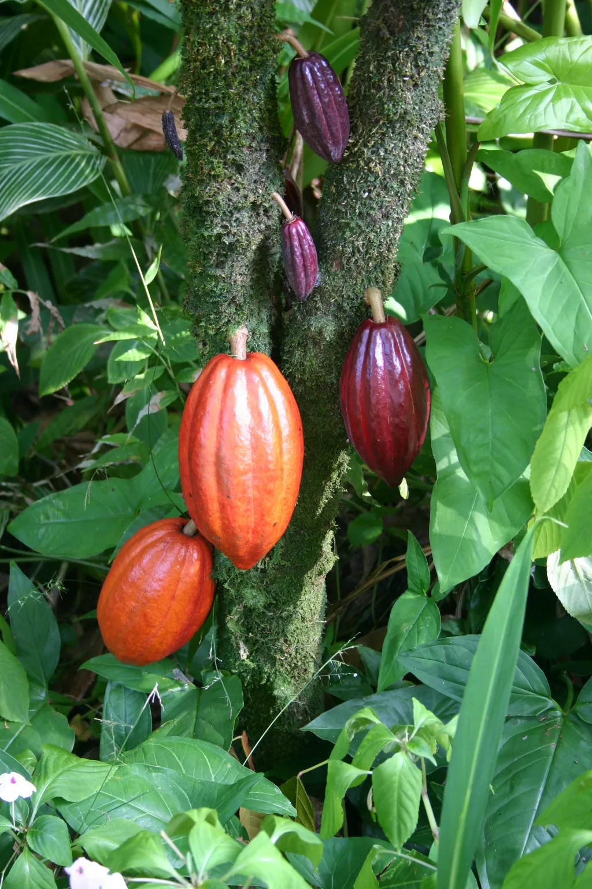
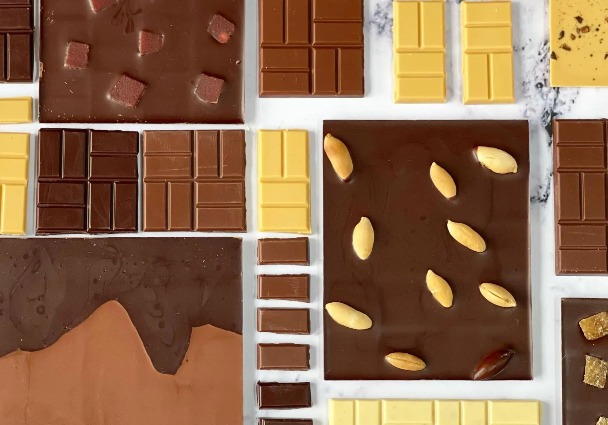
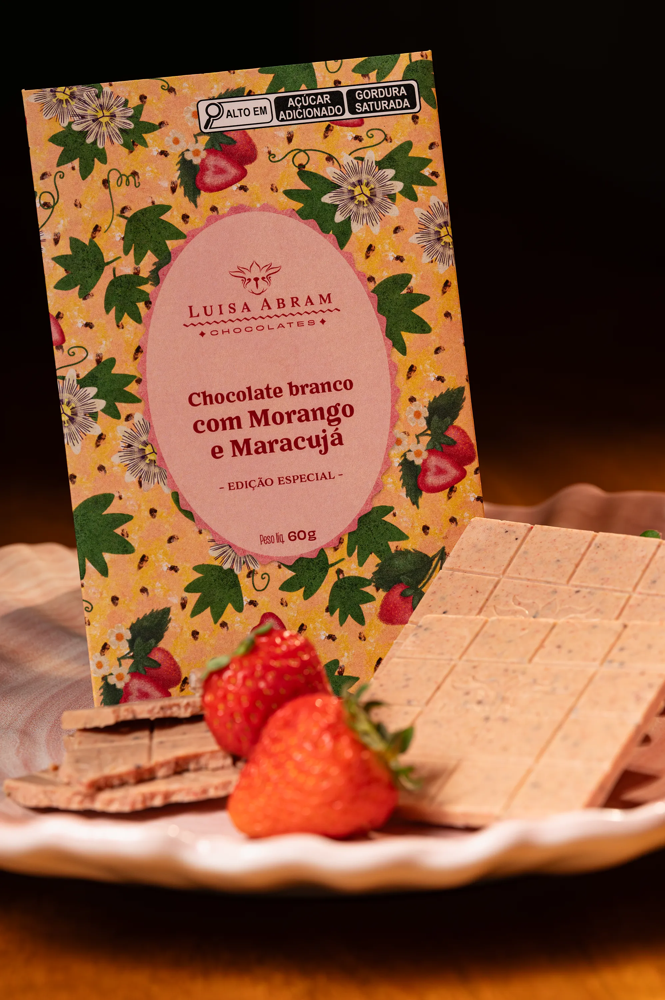
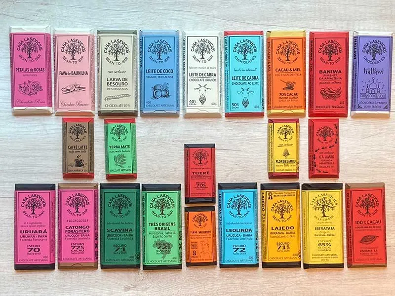
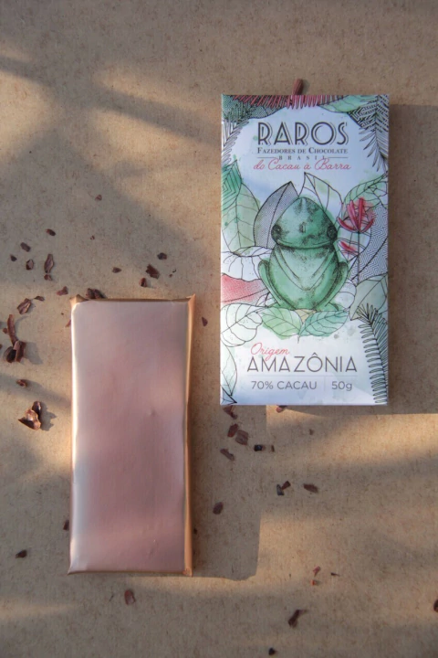
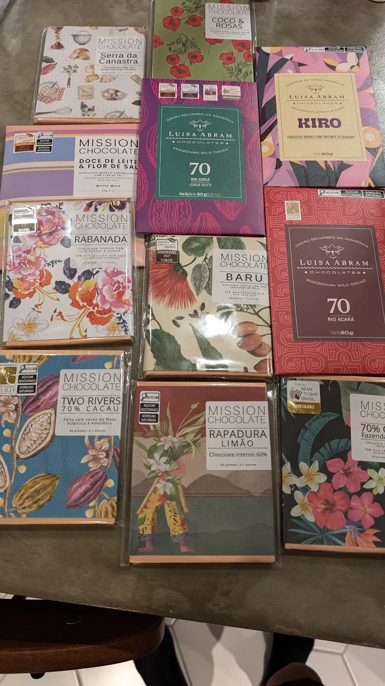
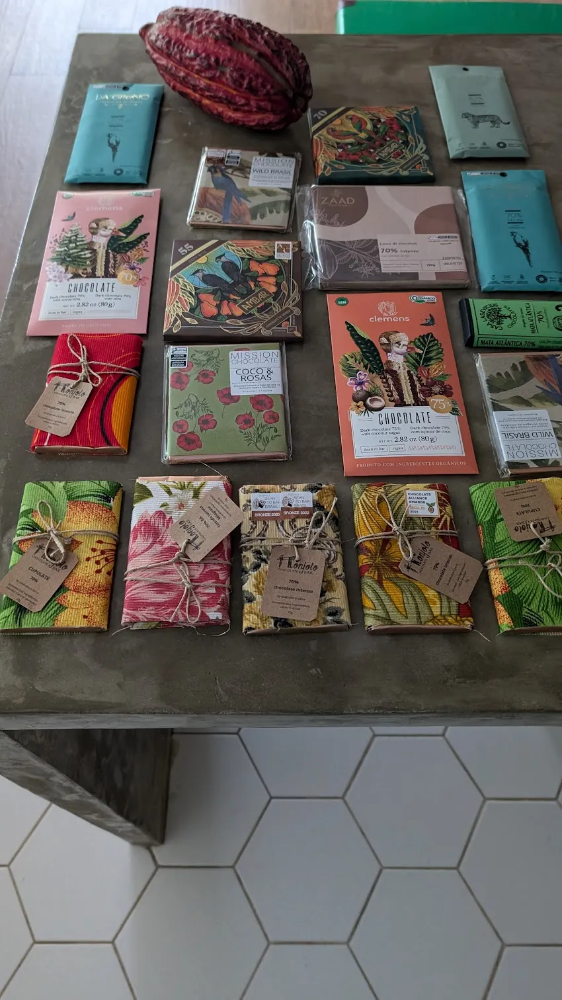
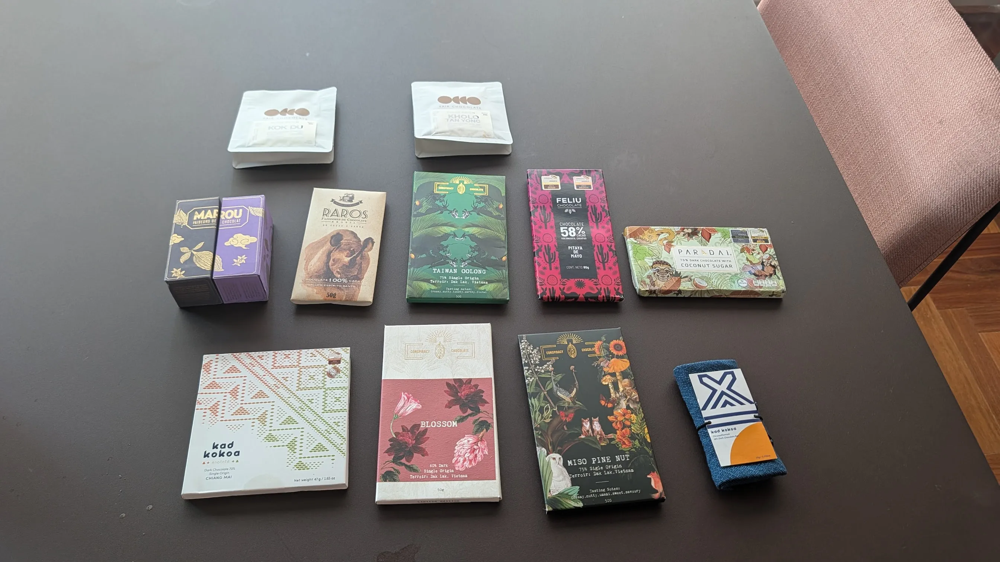
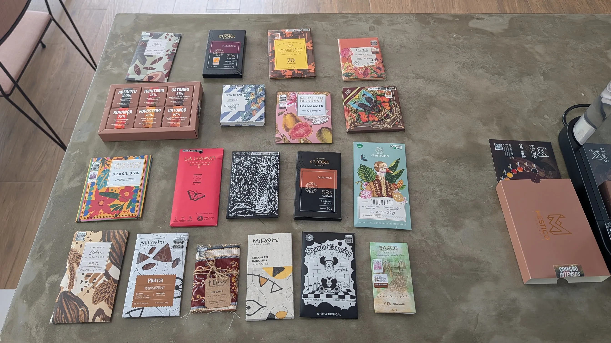

footer: Brazilian Bean to Bar
slidenumbers: true
autoflow: true

#[fit] Brazilian
#[fit] Bean to Bar
#[fit] **Chocolate**

From cacao farm to finished bar.

---

Bean to bar:
one maker controls the entire process.

Sources, roasts, grinds,
conches, tempers, packages.

---

# The Process

:::diagram
graph LR
  A[Harvest & Ferment] --> B[Dry & Roast]
  B --> C[Crack & Grind]
  C --> D[Conch & Temper]
  D --> E[Mold & Package]
  style A fill:#8B4513,stroke:#5C3317,color:#fff
  style B fill:#D2691E,stroke:#8B4513,color:#fff
  style C fill:#A0522D,stroke:#6B3A2A,color:#fff
  style D fill:#704214,stroke:#3E2723,color:#fff
  style E fill:#1B0E07,stroke:#000,color:#fff
:::

^ Each step affects flavor. Temperature, time, and technique create the maker's signature.

---

[.background-color: #3E2723]
[.header: #DEB887]

#[fit] One bean.
#[fit] **Infinite** flavors.

^ Same cacao variety, different soil, fermentation, roasting → completely different chocolate.

---

# Industrial vs. Craft

:::columns
## Industrial
- Bulk cacao, commodity markets
- Heavy roasting hides defects
- Cocoa butter, vanilla, lecithin added
- Standardized flavor

:::
## Bean to Bar
- Single-origin, traceable beans
- Light roast preserves terroir
- Cacao + sugar. That's it.
- Unique flavor per batch
:::

^ Supermarket bars: 5-10% cacao. Craft bars: 65-80%+.

---

[.background-color: #3E2723]
[.header: #DEB887]

#[fit] Brazilian Makers

Brazil is the 7th largest cacao producer. Bahia, Para, Espirito Santo.

---

# Mission Chocolate

Sao Paulo — Arcelia Gallardo

50+ awards in 5 years. Trained at Dandelion (SF).
Pays farmers 4x market price.
Most awarded brand in Brazil.

---

# Luisa Abram

Wild cacao from the Amazon (Purus River).

Two ingredients: cacao and sugar.

---

# Lasevicius

Sao Paulo — Leo Lasevicius

Former pastry chef turned chocolate maker.
Multiple international gold awards.
Known for precision and clean flavors.

---

# Raros Fazedores de Chocolate

Cunha, SP — small-batch, artisan.

"Colecao Intensos" series. Bronze at Bean to Bar Brasil.
Deep focus on single-origin Brazilian cacao.

---

# Caza Chocolates

Perdizes, Sao Paulo.
Cacao from Linhares, Espirito Santo.
Beans roasted and processed in-house.

---

# Odle Chocolate

Minas Gerais — 17+ international awards.
Tuere cocoa: gold at the Academy of Chocolate Awards (UK).

---

# And Many More

Over 150 bean-to-bar makers in Brazil today.

Full list: **beantobarbrasil.com.br/lista-associados**

Mestico, Nugali, Cuore di Cacao, Flanjolo,
Miroh!, A Pauta Company, Clemens, La Greno,
ZAAD, Dengo, Baiani, Belvie...

---

# My Collection

 

 

^ Mission, Luisa Abram, Mestico, Clemens, Conspiracy, Kad Kokoa, Marou, Raros, and more.

---

# Awards & Competitions

- **Academy of Chocolate Awards** (London) — the Oscars of craft chocolate
- **International Chocolate Awards** — world's largest independent competition
- **Bean to Bar Brasil** — Brazilian national awards

Brazilian makers win gold regularly at all three.

---

[.background-color: #3E2723]
[.header: #DEB887]

# Thank You

**From bean to bar, every step matters.**

beantobarbrasil.com.br
