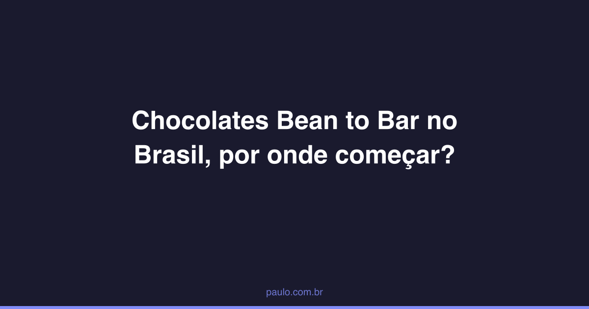

footer: Bean to Bar Chocolate
slidenumbers: true

#[fit] Bean to Bar
#[fit] **Chocolate**

A journey from cacao farm to finished bar.

^ This presentation covers the craft chocolate movement, how it differs from industrial chocolate, and the world's most celebrated makers.

---

# What is Bean to Bar?

A chocolate maker who controls the entire process:

- 🌱 **Sources** cacao beans directly from farms
- 🔥 **Roasts** the beans in-house
- ⚙️ **Grinds, conches, tempers** — small-batch machines
- 📦 **Packages** the final bar

^ Unlike industrial chocolate (Nestle, Mars) which buys pre-processed cocoa mass, bean-to-bar makers start from raw cacao beans.

---

# The Process

:::diagram
graph LR
  A[Cacao Pod] --> B[Fermentation]
  B --> C[Drying]
  C --> D[Roasting]
  D --> E[Cracking & Winnowing]
  E --> F[Grinding]
  F --> G[Conching]
  G --> H[Tempering]
  H --> I[Molding]
  style A fill:#8B4513,stroke:#5C3317,color:#fff
  style B fill:#D2691E,stroke:#8B4513,color:#fff
  style C fill:#DAA520,stroke:#B8860B,color:#fff
  style D fill:#CD853F,stroke:#8B6914,color:#fff
  style E fill:#DEB887,stroke:#D2B48C,color:#333
  style F fill:#A0522D,stroke:#6B3A2A,color:#fff
  style G fill:#704214,stroke:#3E2723,color:#fff
  style H fill:#3E2723,stroke:#1B0E07,color:#fff
  style I fill:#1B0E07,stroke:#000,color:#fff
:::

^ Each step affects flavor. Temperature, time, and technique create the maker's signature profile.

---

[.background-color: #3E2723]
[.header: #DEB887]

#[fit] 🍫
#[fit] One bean.
#[fit] **Infinite** flavors.

^ The same cacao variety grown in different soils, fermented differently, roasted at different temperatures — produces completely different chocolate. That's the magic of bean to bar.

---

# 🏭 Industrial vs. ✋ Craft

:::columns
## Industrial
- Bulk cacao from commodity markets
- Heavy roasting hides defects
- Added cocoa butter, vanilla, lecithin
- Standardized flavor

:::
## Bean to Bar
- Single-origin, traceable beans
- Light roast preserves terroir
- Minimal ingredients (cacao + sugar)
- Unique flavor per batch
:::

^ Most chocolate bars in supermarkets use 5-10% actual cacao. Craft bars are typically 65-80%+ cacao.

---

[.background-color: #3E2723]
[.header: #DEB887]

#[fit] 🇧🇷
#[fit] Brazilian Makers

---

# Mission Chocolate

Sao Paulo, Brazil — Arcelia Gallardo

Trained at Dandelion Chocolate in San Francisco.
50+ national and international awards in 5 years.
Pays farmers 4x market price for cacao.

**Most awarded** chocolate brand in **Brazil**.

^ TODO: add Mission photo

---

# Luisa Abram

Sao Paulo, Brazil — since 2014

Small-batch chocolate from wild cacao
in the Amazon rainforest (Purus River).

Only **two** ingredients: **cacao** and **sugar**.

^ TODO: add Luisa Abram bar photo

---

# Caza Chocolates

Perdizes, Sao Paulo

Cacao sourced from farms in Linhares, Espirito Santo.
Beans roasted, hulled, and processed in-house.

^ TODO: add Caza photo

---

# Odle Chocolate

Minas Gerais, Brazil — since 2016

17+ international awards.
Tuere cocoa won gold at the UK Academy of Chocolate Awards.

^ TODO: add Odle photo

---

[.background-color: #1B0E07]
[.header: #DEB887]

#[fit] 🇺🇸
#[fit] American Makers

---

# Dandelion Chocolate

San Francisco, USA — since 2010

Transparent sourcing, single-origin bars.
Their 70% Madagascar is a benchmark.

^ TODO: add Dandelion photo

---

# Dick Taylor

Arcata, California — since 2008

Small-batch, hand-crafted.
Only organic cacao and organic cane sugar.

^ TODO: add Dick Taylor photo

---

# Raaka

Brooklyn, New York — since 2010

Virgin chocolate: stone-ground, low-temperature.
Preserves raw cacao flavors. Organic and vegan.

^ TODO: add Raaka photo

---

# Fruition Chocolate

Shokan, New York — since 2011

Ethical sourcing and unique flavor combinations.

^ TODO: add Fruition photo

---

[.background-color: #3E2723]
[.header: #DEB887]

#[fit] 🇻🇳
#[fit] Around the World

---

# Marou

Ho Chi Minh City, Vietnam — since 2011

Two Frenchmen making chocolate from Vietnamese cacao.
Ben Tre 78% won multiple international awards.

^ TODO: add Marou photo

---

# My Collection

^ TODO: Paulo will add personal photos of chocolates from Thailand, Vietnam, China

---

# Awards & Associations

- 🏆 **Academy of Chocolate Awards** (London) — The Oscars of craft chocolate
- 🌍 **International Chocolate Awards** — World's largest independent competition
- 🇺🇸 **Good Food Awards** — US craft food recognition
- 🌱 **Cocoa of Excellence** — Celebrates cacao farmers

^ These awards drive quality and transparency in the industry.

---

# Places Around the World

^ TODO: Paulo will add photos of chocolate shops he visited

---

[.background-color: #3E2723]
[.header: #DEB887]

# Thank You

**From bean to bar, every step matters.**

academyofchocolate.org.uk
internationalchocolateawards.com
