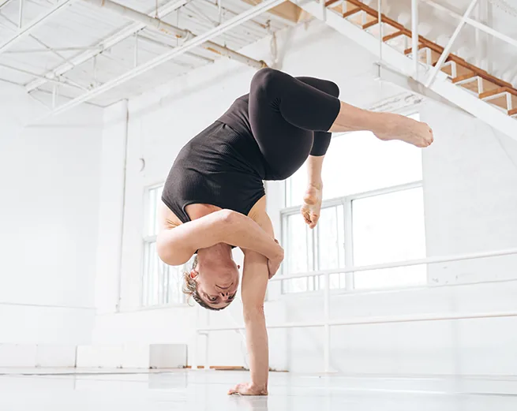
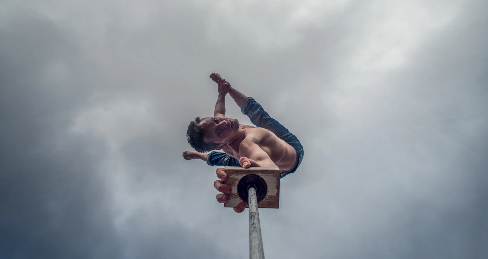
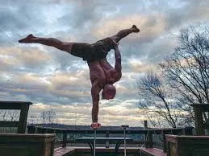
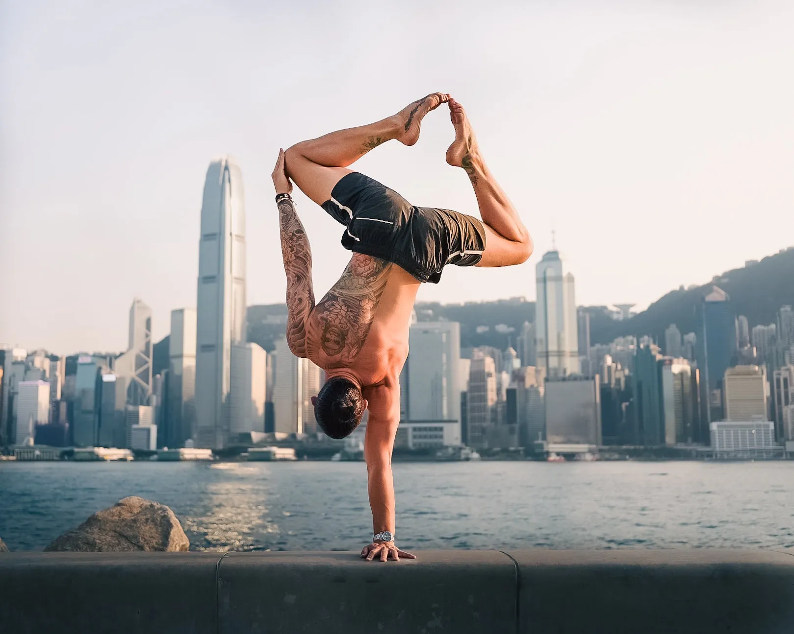
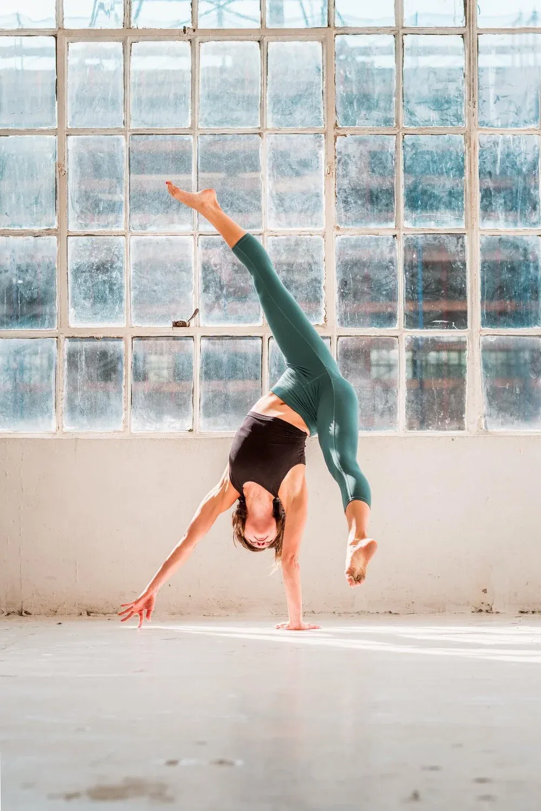
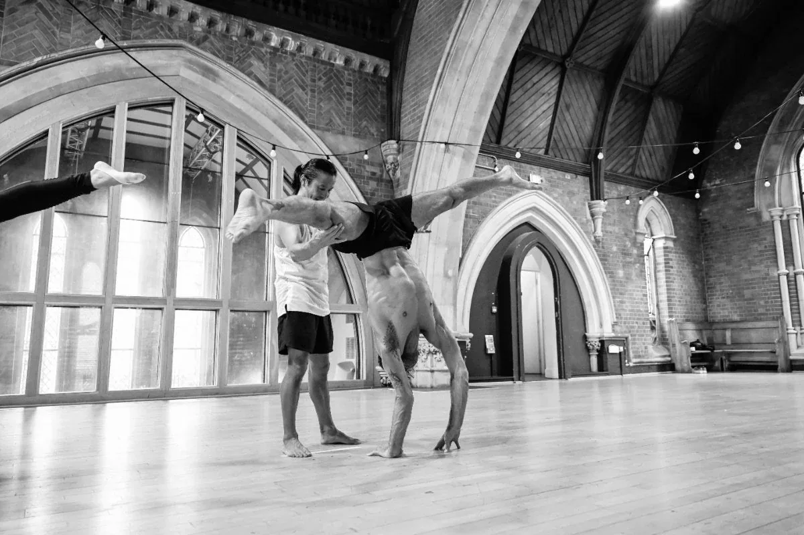
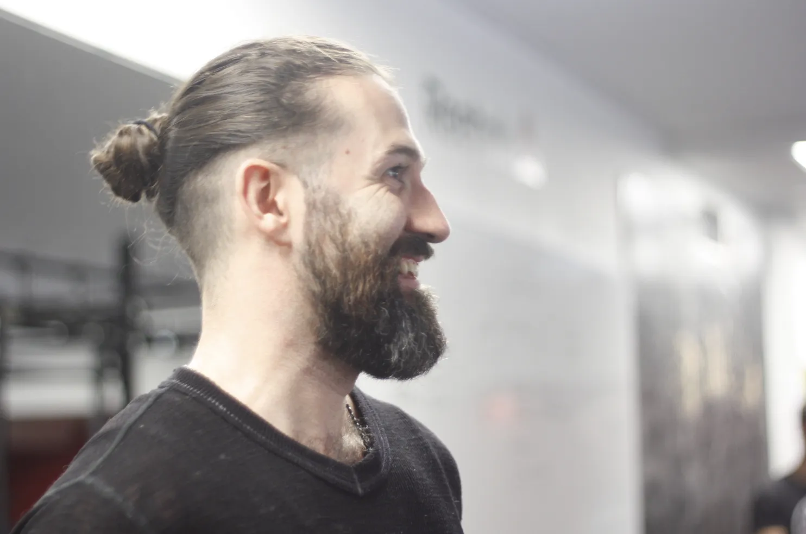
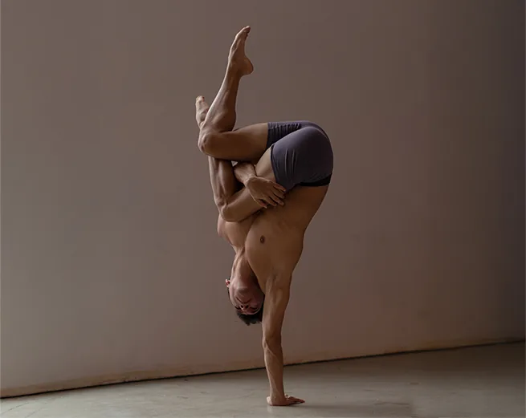
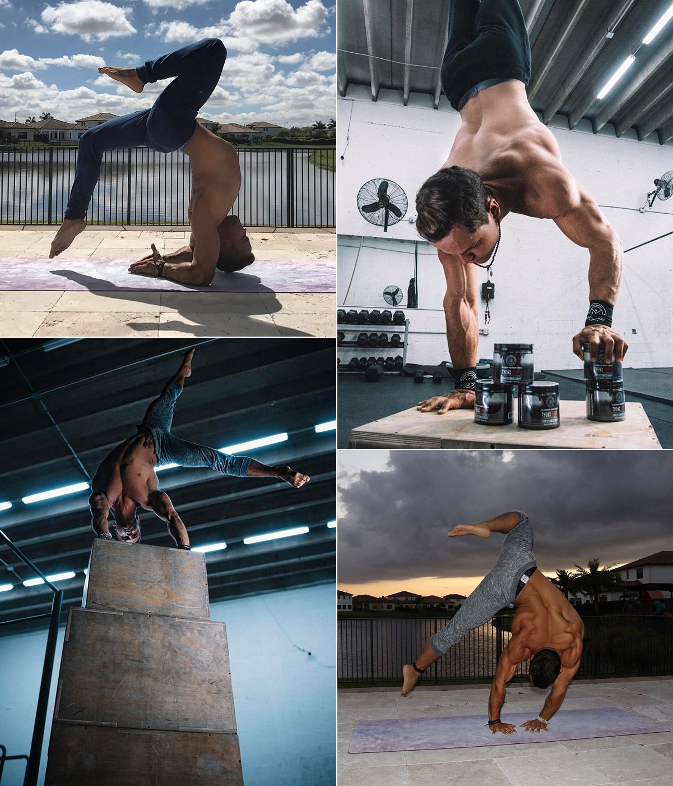

footer: The Art of Hand Balancing
slidenumbers: true

#[fit] The Art of
#[fit] **Hand Balancing**

From circus tradition to modern movement culture.

---

# What is Hand Balancing?

The art of supporting your body on your hands — from a simple handstand to complex one-arm balances and press handstands.

- **Circus** tradition dating back centuries
- Modern **movement culture** revival since ~2010
- Combines **strength**, **flexibility**, and **patience**

^ Unlike gymnastics (which values dynamic power), hand balancing values control, stillness, and endurance.

---

# The Discipline

:::columns
## Strength
Press to handstand, one-arm holds, flags

:::
## Flexibility
Shoulder mobility, back bending, splits

:::
## Balance
Proprioception, micro-adjustments, breathing
:::

^ A typical training session is 1.5-3 hours. Most of that time is spent balancing, falling, and trying again.

---

[.background-color: #1a1a2e]
[.header: #e2e8f0]

#[fit] 🤸
#[fit] Fall. Get up.
#[fit] **Balance.**

^ The first year is mostly falling. The magic happens when you stop fighting gravity and start working with it.

---

[.background-color: #1a1a2e]
[.header: #e2e8f0]

#[fit] Notable
#[fit] Hand Balancers

---

# Andrii Bondarenko

Las Vegas, USA
[@andrii_bondarenko](https://instagram.com/andrii_bondarenko)

World champion in sports acrobatics.
Cirque du Soleil's KURIOS.
Spiegelworld's Absinthe.

---

# Yuval Ayalon

Los Angeles, USA
[@yuvalayalon](https://instagram.com/yuvalayalon)

Hand balancer and movement artist.
Workshops and intensives worldwide.

---

# Marie-Eve Dicaire

Montreal, Canada
[@dicairemarieeve](https://instagram.com/dicairemarieeve)

National Circus School of Montreal.
Cirque du Soleil, Les 7 doigts, Cirque Eloize.
Co-founder of Balance Notion.

---

# Mikael Kristiansen

Copenhagen, Denmark
[@mikaelbalancing](https://instagram.com/mikaelbalancing)

"Handstand Factory" — one of the most
popular online programs.

---

# Yuri Marmerstein

Las Vegas, USA
[@yurimarmerstein](https://instagram.com/yurimarmerstein)

Author of "Balancing the Equation."
Pioneer of modern hand balancing.

---

# Miguel Santana

Lisbon, Portugal
[@miguel_hand_balance](https://instagram.com/miguel_hand_balance)

Workshops and retreats across Europe.
Known for clean lines and creative flows.

---

# Adell Bridges

Austin, USA
[@adellbridges](https://instagram.com/adellbridges)

Hand balancer, aerialist, and coach.

---

# Sainaa

Berlin, Germany
[@sainaabalance](https://instagram.com/sainaabalance)

Mongolian-born. Traditional circus training
meets European hand balancing.

---

# Emmet Louis

Ireland
[@emmetlouis](https://instagram.com/emmetlouis)

Movement generalist. Analytical approach
to movement practice.

---

# Nicolas Montes de Oca

Montreal, Canada
[@nicolasmontesdeoca](https://instagram.com/nicolasmontesdeoca)

National Circus School graduate.
Co-founder of Balance Notion.

---

# Gabo Saturno

Caracas, Venezuela
[@gabosaturno](https://instagram.com/gabosaturno)

Saturno Movement (1M+ YouTube).
Calisthenics, yoga, hand balancing.

---

[.background-color: #1a1a2e]
[.header: #e2e8f0]

# Training Progression

:::diagram
graph TD
  A[Wall Handstand] --> B[Freestanding Hold]
  B --> C[Press Handstand]
  B --> D[One Arm Training]
  C --> E[Straddle Press]
  D --> F[One Arm Hold]
  E --> G[Full Press Variations]
  F --> H[One Arm Transitions]
  style A fill:#3b82f6,stroke:#1d4ed8,color:#fff
  style B fill:#8b5cf6,stroke:#6d28d9,color:#fff
  style C fill:#10b981,stroke:#059669,color:#fff
  style D fill:#f59e0b,stroke:#d97706,color:#fff
  style E fill:#10b981,stroke:#059669,color:#fff
  style F fill:#f59e0b,stroke:#d97706,color:#fff
  style G fill:#ec4899,stroke:#be185d,color:#fff
  style H fill:#ec4899,stroke:#be185d,color:#fff
:::

^ Wall handstand to freestanding: 3-12 months. Freestanding to one-arm: 2-5+ years.

---

# Community & Resources

- **Handstand Factory** — online programs by Mikael & Emmet
- **Balance Notion** — workshops by Marie-Eve & Nicolas
- **Saturno Movement** — YouTube tutorials by Gabo
- **"Balancing the Equation"** — Yuri's book

^ The hand balancing community is small but global. Most learning happens through retreats, workshops, and Instagram.

---

# Thank You

**Keep practicing. Keep falling. Keep getting back up.**

^ TODO: Paulo will add personal handstand photos
