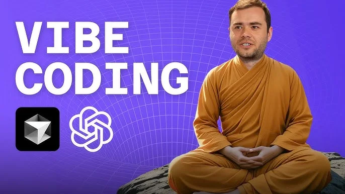
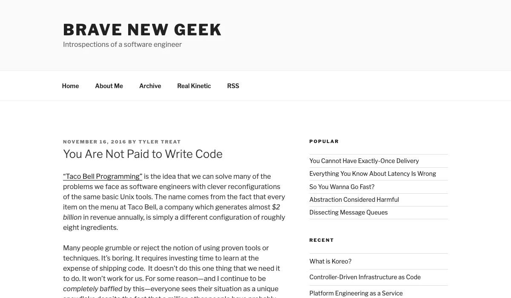
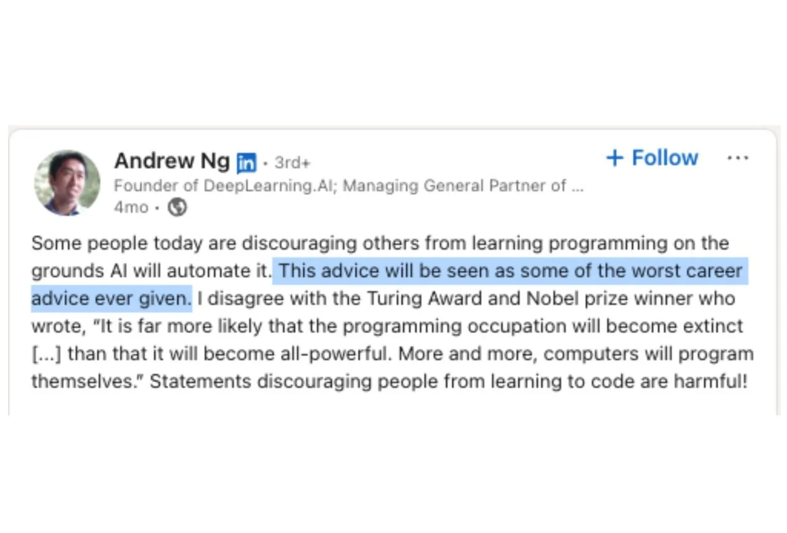
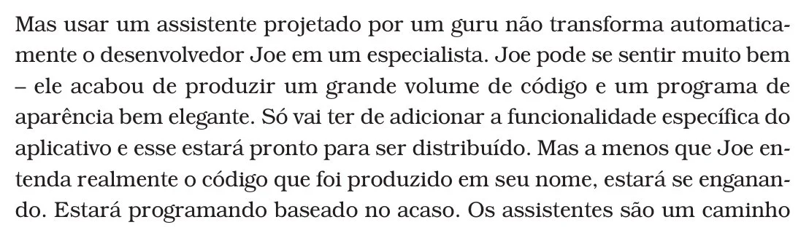

footer: stellardeck.dev
slidenumbers: true



#[fit] Vibe Coding
#[fit] and the **New Dev**

Why I went back to programming...

^ Paulo Silveira — Grupo Alun
^ This talk is about the 3 skills every modern developer needs in the age of AI.

---

#[fit] 2016

---



#[fit] You are **not** paid
#[fit] to write **code**.

^ Tyler Treat, 2016. The quote that stayed with me.

---

#[fit] Code is a nasty
#[fit] byproduct of being
#[fit] a software engineer.

^ "Every time you write code, you are introducing the possibility of failure into your system."

---

#[fit] 2026

---

#[fit] "Everyone can code"
#[fit] ...say those who
#[fit] **don't** code.

^ The hype cycle is real. But writing working software is still hard.

---



^ Andrew Ng: "Just as I think almost everybody should learn to read and write, I think almost everybody should learn to program."

---

#[fit] Software
#[fit] is **not** solved.

^ Despite all the AI progress, we still need engineers who understand systems.

---

#[fit] The 3 Skills
#[fit] of the **New Dev**

---

[.background-color: #1e3a5f]

#[fit] 1

---

#[fit] Know how to code.

^ More than ever. You need to master stacks, architecture, the web — to tame metaprogramming tools.

---



# The Pragmatic Programmer

Hunt & Thomas, 1999.

"Care about your craft. Think about your work."

^ 25 years later, still the foundation. If you can't code, you can't vibe.

---


#[fit] If you don't speak
#[fit] the **language**,
#[fit] you don't **think**
#[fit] in it.

^ "Seven Languages in Seven Weeks" — Bruce Tate. Each language is a way of thinking.

---

# Sapir-Whorf Hypothesis

To what extent does our language
govern our thought process?

^ The language you speak shapes how you think. This applies to programming languages too.

---

[.background-color: #1e3a5f]

#[fit] 2

---

#[fit] Generalist
#[fit] Specialist.

^ The T-shaped professional: deep in one area, broad across many.

---

[.background-color: #1e3a5f]

#[fit] 3

---

#[fit] Vibe Coding.

^ Andrej Karpathy coined the term in February 2025. "You fully give in to the vibes, embrace exponentials, and forget that the code even exists."

---

# What is Vibe Coding?

```python
# You describe what you want
# The AI writes the code
# You review, iterate, ship

prompt = "Build a REST API for user auth"
result = ai.generate(prompt, context=codebase)
```

^ It's not about replacing programmers. It's about amplifying them.

---

#[fit] The best developers
#[fit] are the ones who
#[fit] understand **both**
#[fit] **worlds**.

^ Code AND AI. Systems AND prompts. Architecture AND vibes.

---

# Thank You

**Paulo Silveira**
paulo.com.br/about

^ First presented at RH Festival StartSe, Sao Paulo, March 2026.
