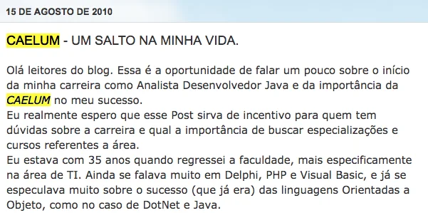
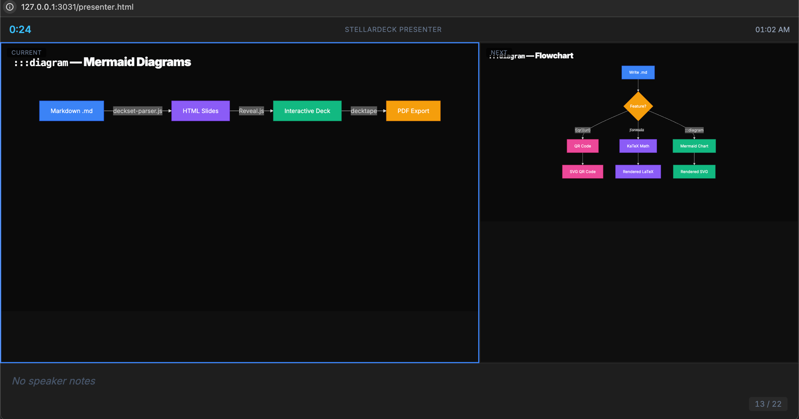

footer: StellarDeck Feature Showcase
slidenumbers: true
slide-transition: fade


# StellarDeck Features
## Complete Showcase

^ Welcome to the StellarDeck feature showcase. This deck demonstrates every supported markdown feature. Press P to open presenter mode and see these notes.

---

# Accent **Bold** Colors

In themes with accent support, **bold words** render in the theme's **accent color** automatically.

- **Highlights** draw the eye to key points
- Regular items provide **context**
- Works in Nordic, Keynote, Alun, Poster, and Borneli

^ Activated per theme via --sd-accent-bold-color. Some themes also colorize list bullet markers.

---

[.alternating-colors: true]

# `[.alternating-colors: true]`

Are companies more **welcoming** or more fragile?

Does fear of discomfort weaken **culture**?

Does our culture protect adults from **reality**?

^ Alternating colors: odd paragraphs main, even paragraphs accent. Great for provocative question slides.

---

[.build-lists: true]

# `[.build-lists: true]` — Build Lists

- First item appears
- Second item appears
- Third item appears

^ Build lists reveal items one by one using fragments. Add the directive at the top of any slide. Great for progressive disclosure.

---

# ` ```lang {lines} ` — Syntax Highlighting

```python {2}
def greet(name):
    return f"Hello, {name}!"  # highlighted line

greet("StellarDeck")
```

^ Fenced code blocks support language detection and line highlighting. Use {2} or {2-5} after the language name to highlight specific lines. Powered by highlight.js.

---

# Markdown Table

| Feature | Status | Since |
|:--------|:------:|------:|
| Tables | Done | v0.1 |
| Columns | Done | v0.1 |
| Math | Done | v0.2 |
| QR Codes | Done | v0.2 |
| Diagrams | Done | v0.2 |

^ Standard GFM tables with alignment. Use :--- for left, :---: for center, ---: for right alignment.

---

[.header: #64ffda]
[.text: #8892b0]
[.background-color: #0a192f]

# `[.header]` `[.text]` `[.background-color]`

Custom heading and text colors per slide.

^ Color directives override the theme for a single slide. Useful for emphasis slides or section dividers. Colors use CSS hex notation.

---

# `:::columns` — Multi-Column Layout

:::columns
## Before
- Manual process
- Error-prone
- Hours of work

:::
## After
- Automated
- Reliable
- Minutes
:::

^ Two-column layout using :::columns. Separate columns with ::: inside the block. Each column gets equal width automatically.

---

# `:::columns` — Three Columns

:::columns
## Plan
Define scope and goals

:::
## Build
Ship iteratively

:::
## Measure
Learn and adapt
:::

^ Three columns work the same way. The grid-template-columns adjusts automatically based on the number of ::: separators found.

---

# `:::steps` — Incremental Reveal

:::steps
First, we write markdown.

Then, StellarDeck renders it beautifully.

Finally, we present with confidence.
:::

^ Steps wraps each paragraph in a fragment. They appear one at a time on click/arrow, like build-lists but for paragraphs.

---

:::center
# `:::center`

**Paulo Silveira**
@paulosilveira
:::

---

# `$...$` — Inline Math

The loss function: $L = -\sum_{i} y_i \log(\hat{y}_i)$

Euler's identity: $e^{i\pi} + 1 = 0$

^ Inline math uses dollar signs. Single $ for inline, $$ for display block. Protected from italic formatting — the parser uses a placeholder system to avoid conflicts.

---

# `:::math` — Block Math

:::math
\theta_{t+1} = \theta_t - \alpha \nabla J(\theta_t)
:::

^ Block math: gradient descent formula

---

# `$$...$$` — Display Math

$$E = mc^2$$

The most famous equation in physics.

---

# `:::diagram` — Mermaid Diagrams

^ Mermaid diagrams render as SVG. Uses the handDrawn look by default. Supports flowcharts, sequence diagrams, class diagrams, and more. Loaded lazily from CDN.

:::diagram
graph LR
  A[Markdown .md] -->|deckset-parser.js| B[HTML Slides]
  B -->|StellarSlides| C[Interactive Deck]
  C -->|decktape| D[PDF Export]
  style A fill:#3b82f6,stroke:#1d4ed8,color:#fff
  style B fill:#8b5cf6,stroke:#6d28d9,color:#fff
  style C fill:#10b981,stroke:#059669,color:#fff
  style D fill:#f59e0b,stroke:#d97706,color:#fff
:::

---

# `:::diagram` — Flowchart

:::diagram
flowchart TD
  A[Write .md] --> B{Feature?}
  B -->|""| C[QR Code]
  B -->|"$$formula$$"| D[KaTeX Math]
  B -->|":::diagram"| E[Mermaid Chart]
  C --> F[SVG QR Code]
  D --> G[Rendered LaTeX]
  E --> H[Rendered SVG]
  style A fill:#3b82f6,stroke:#1d4ed8,color:#fff
  style B fill:#f59e0b,stroke:#d97706,color:#fff
  style C fill:#ec4899,stroke:#be185d,color:#fff
  style D fill:#8b5cf6,stroke:#6d28d9,color:#fff
  style E fill:#10b981,stroke:#059669,color:#fff
  style F fill:#ec4899,stroke:#be185d,color:#fff
  style G fill:#8b5cf6,stroke:#6d28d9,color:#fff
  style H fill:#10b981,stroke:#059669,color:#fff
:::

---


^ Full-slide QR code for the StellarDeck repo

---


# `![qr, right]` — Split QR

Scan the QR code or visit:
github.com/peas/stellardeck

---

# `^` and `<!-- -->` — Speaker Notes

This slide has a note visible only in presenter mode.

^ This is a classic Deckset-style note too.

<!-- This is an HTML comment note -->

---



# `![filtered]` — Dark Overlay

Text readable over dark-filtered image.

^ Filtered images get a dark overlay (black background + reduced opacity) so white text remains readable. The original Deckset behavior.

---


# `![right]` — Split Layout

Image on the right, text on the left.

- Point A
- Point B

---

#[fit] Big Bold
#[fit] Statement

^ The #[fit] modifier auto-sizes headings to fill the slide width. Uses binary search on an off-screen DOM element for pixel-perfect measurement. Multiple #[fit] headings stack vertically.

---

[.slide-transition: zoom]

# `[.slide-transition: zoom]`

Per-slide transition override.

---

> "The best way to predict the future is to invent it."

Alan Kay

^ Blockquotes render with a left border accent and italic styling. Great for closing slides with an inspiring quote.

---



# First Talk with StellarDeck

^ StartSe RH Leadership Festival 2026, Sao Paulo. ~2,000 people. PDF export via decktape.

